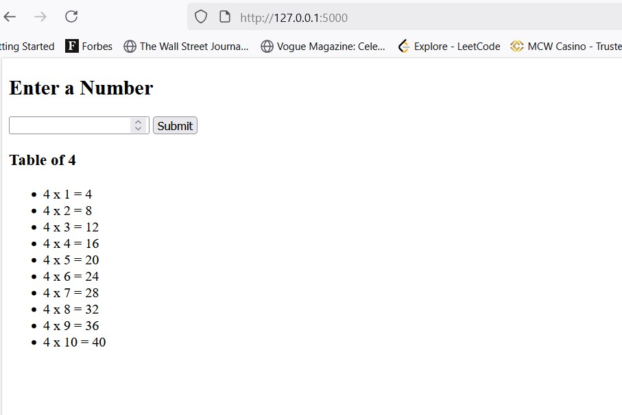

# Multiplication Table Web App

A simple Flask web app that takes a number as input and displays its multiplication table (1–10).  
Created as a mini project while learning **Flask** and **Docker**.

## Screenshot


## Features
- Enter a number and generate its multiplication table
- Flask backend with a simple HTML form
- Dockerized for easy deployment

## Tech Stack
- Python 3.10
- Flask
- Docker

## Run Locally
Make sure you have Python and Flask installed.

```bash
pip install flask
python app.py 
```

## Run with Docker
Build the Docker image:

```bash
docker build -t flask-table-app .
```
Run the container:
```bash
docker run -p 8888:5000 flask-table-app
```


